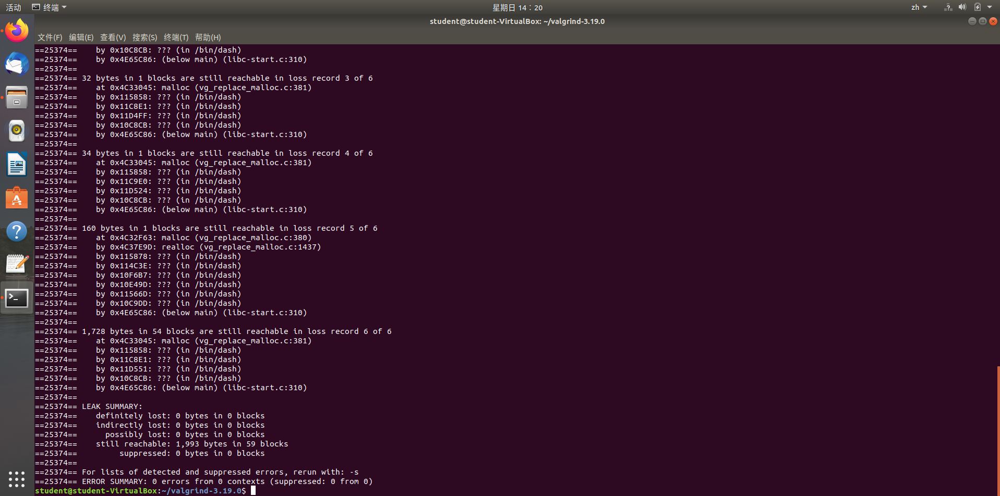

# calculator实验报告
### 2021201645 赵宸
本次试验基本完成了既定的实验项目，实现了保证完全单变量下的函数互调，同时调库实现了特征值得运算。使用valgrint检查，没有内存泄漏现象，初步通过了助教师兄的检查。本实验报告不粘贴代码，如有需要请结合代码观看。   
   

   
   
      
## vector、stack的构建
对于向量和栈的构建，我主要参考了课本上的代码，选择自己能用到的函数，把课本精简的代码转化成我能看懂的人话，然后<s>复制粘贴</s>（不是）。总体上的实现逻辑还是利用expand检测和开辟空间，同时用shrink随时控制占用空间的大小。没有考虑实现存储空间的复用。整体来说比较粗糙。
## 一元多项式运算
既然是一元多项式，那我们的核心操作就不应该放在变元身上，而应重点关注系数。因此我就最简化，只要求输入者输入系数，然后原本的多项式处理就变成数据运算了。   
先将数据按变元次数依次存储，开三个数组，分别对应x *（运算符）* y = z。加法就是按位数值相加,减法也是按位数值相减，乘法则采取O(n^2)的按位做乘法然后相加。微分和积分的数据则是与该位置的次数做运算之后在移动到前一位或者后一位。   
在完成以上运算之后，运算的结果会被保存到x *（运算符）* y = z中x对应的数组中以供下一次运算使用，而此时y和z则会memset掉，下次的数据读取也会读取到y中而不会触及x。当然这就涉及一个问题，如果我要连续做两次结果不相干的加减乘，我就必须要重启计算器，这也是我的程序的一个弊端。
## 四则运算
四则运算也是基本采用了课本的代码作为基本框架。如果读到左括号无脑压栈，读到运算符利用运算符的优先级判断大小，低优先级的运算无脑压栈，高优先级的运算符将栈内元素提到不能再提为止。读到右括号开始弹栈直到弹到左括号或弹完为止（此时报错：栈内元素不足）。   
更为精细化的部分就是多个负号情况的处理。我的处理方案是在每个负号前边添0，再在0前边添加适当的过渡运算符。，就目前来看效果可观。   
在把string的数字转化为double类型数据的过程中我用到了大一上学期经常使用的函数atof，因此这省去了我额外考虑浮点数的时间，也算是一个小trick吧。
## 矩阵运算
之前接触机器学习的内容比较多，因此一想到矩阵运算，下意识：调库！事实上最后调库起了多少作用呢……不好评价。加减非常简单对应相加，乘法转置和行列式都是大一写过有现成代码的，而唯一做不了的特征值也被砍去了……为了发挥我调库的优势，我强行把行列式的运算改成了Eigen库函数。效果就是我最多可以完成200*200的行列式运算。而这在传统的O(n^2)的高斯消元法这里显然是一件不可能的事情。我会保留我之前写的高斯消元法版本的行列式代码，如果助教需要我可以再将这部分代码做替换。既然是选择调库，也就不再有什么实验难度了。
## 一元表达式运算
鉴于此时四则运算已经写完了，而且是用string类型传入完成的，因此就很自然的想到使用代码复用完成一元表达式的运算。   
首先我可以对传入的string做一个遍历，寻找那些不是运算符和数字的东西。如果找到了那就以他们为基点。先往前找，理论上前边应该是运算符，如果不是运算符那只能说明输入不符合c++标准，直接报错；再往后找，一直找到运算符为止，这样就可以轻易地锁定未知量的位置和长度。   
此时我只需要用string的replace函数把这个未知量替换成数字，就实现了把一元表达式变成四则运算式的任务，然后传入四则运算函数即可。   
这样写看似很好，实则忽略了一个重要的问题，我这段代码要被一元函数复用，而一元函数要检测变量特征，而这段代码又恰好是写死的，因此不仅检测过程非常痛苦，而且直接导致了函数互调功能不能完全实现。狭目之见，只能窥底咯。
## 一元函数
刚写的时候以为一元函数和一元表达式基本一致，因此打算披个函数皮然后调取一元表达式的函数。但后续补丁越打越多就导致代码风格非常丑陋……   
核心思路就是先读入一个string，如果是DEF那就调用函数定义，如果是RUN那就调用函数运行。DEF中先检查这个函数名是否出现过，如果出现过直接报错return。调用函数定义的时候呢将string做语法分段。读到左括号之前叫函数名，读到等号之前叫变量名，等号后边就是个一元表达式。由于三个变量都是同时读入同时分析，因此在vector中三者的位置也是一一对应的。这就大大简化了比对的难度。在函数运行的时候，直接一股脑把string传入一元表达式运算函数中。在这个函数里边我来检查变量名是否一致。由于此时函数的位置和变量名的位置对应，因此我可以直接把变量名调出来和即将replace的字符作比较，不一样就报错。一样就替换然后扔到四则运算函数中。这样能比较良好的完成一元函数的题目。   
但也正是因为这些代码写得太死，导致函数互调的时候如果调取函数和被调函数的变量名不同，他也会报错，因为我默认你是一元函数，一元就一到底，因此没有考虑中途改名的问题。这种情况无法处理，如果想为了迎合这种可能而修改，那有1/3的代码逻辑都要微调甚至大改，这种工程量是不可接受的。因此便放弃了这种情况。<s>（我开摆了.jpg）</s>   
### 总而言之，这个lab也算是完成了，虽然效果不尽如人意。希望助教下次写实验要求的时候能明确写明对某个功能哪些要求是硬性的，哪些是可包容的，甚至是一些名词的定义（比如“一元”，“应符合”等等）。
## 实验收获
* 巩固了调库的知识，更加熟练地使用虚拟机和Linux系统，学会了敲命令行，极大地弥补了我之前基本功弱的问题。
* 增强了我对小微型工程的把控力，学会了写代码前先筹划，甚至对代码格式等内容的优化。
* 加深了我对vector等stl的理解
## 不足与反思
* 码代码的时候思路不清晰，不知道这段代码与我的构想是否等价，不会做小范围代码的检查，封装性亟待提升。
* 代码语言粗俗不简洁，代码重用性不高。
* 没有追求过算法，许多地方做了太多冗余操作。
* 过分依赖特殊函数，明显的面向CSDN编程。
## 实机演示
### 一元多项式
#### 一元多项式的加减乘除（以乘为例）
<image src = "1.png" width = "300" height = "200">  

#### 一元多项式的微积分（可对历史记录完成）
<image src = "2.png" width = "300" height = "200">   

### 四则运算
<image src = "3.png" width = "300" height = "200">

### 矩阵运算
#### 行列式和特征值
<image src = "4.png" width = "300" height = "200">
<image src = "5.png" width = "300" height = "200">

#### 矩阵的加减乘除（以乘为例）
<image src = "6.png" width = "300" height = "200">

### 一元表达式
<image src = "7.png" width = "300" height = "200">

### 一元函数
#### 单个函数
<image src = "8.png" width = "300" height = "200">

#### 函数互调
<image src = "9.png" width = "300" height = "200">

## 参考资料
1. 《清华大学计算机系列教材:数据结构(C++语言版)(第3版)》 邓俊辉 清华大学出版社
2. [C/C++带括号四则运算](https://blog.csdn.net/anye3000/article/details/7941231?ops_request_misc=%257B%2522request%255Fid%2522%253A%2522166470359916782388030846%2522%252C%2522scm%2522%253A%252220200713.130102334..%2522%257D&request_id=166470359916782388030846&biz_id=0&utm_medium=distribute.pc_search_result.none-task-blog-2~all~baidu_landing_v2~default-4-7941231-null-null.142^v51^new_blog_pos_by_title,201^v3^add_ask&utm_term=%E5%B8%A6%E6%8B%AC%E5%8F%B7%E5%9B%9B%E5%88%99%E8%BF%90%E7%AE%97&spm=1018.2226.3001.4187)